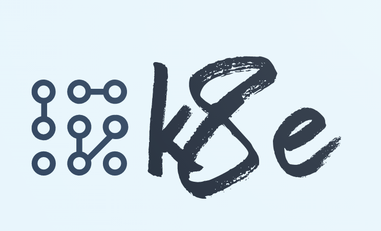

 
K8e 🚀 - Kubernetes Enterprise Edition that is ready to use immediately.
===============================================
[Kubernetes Easy Engine(k8e)🚀](https://getk8e.com) is a lightweight, scalable enterprise-grade Kubernetes distribution that allows users to manage, protect and obtain out-of-the-box Kubernetes clusters in a unified manner. It is suitable for enterprise environments.

 

# ✅ Features
- [x] Support k8s components airgap images package
- [x] 10 year certificate, support cluster backup, upgrade
- [x] No dependency on ansible haproxy keepalived, a binary tool, 0 dependency
- [x] natively support cilium network
- [x] no kube-proxy component

Quick-Start - Building && Installing
--------------
https://getk8e.com/docs/install/200-quick-start/

Acknowledgments
--------------
- Thanks [k3s](https://github.com/rancher/k3s) for the great open source project.
