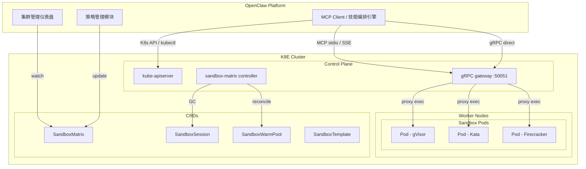

# KIP-5: OpenClaw 一键管理 K8E 沙箱集群

| Author | Updated | Status |
|--------|---------|--------|
| @xiaods | 2026-05-19 | Draft |

## Summary

设计 OpenClaw 与 K8E 沙箱集群的集成方案，使 OpenClaw 通过 MCP Client 协议接入 K8E 内置的 `sandbox-mcp` 服务，获得对沙箱集群的完整管理能力——包括创建/销毁会话、执行代码、管理运行时策略以及监控集群状态。集成分为三层：MCP 协议直连（零开发）、gRPC 高性能调用、CRD 深度管控。

## Motivation

KIP-3 和 KIP-4 已经交付了完整的沙箱基础设施：gRPC 网关、MCP 服务器、Python/TypeScript SDK。但在实际使用中存在以下问题：

1. **缺少统一管控入口**：当前需要通过 `kubectl` + `k8e sandbox-mcp` 两条路径分别管理集群和沙箱
2. **AI Agent 接入成本高**：每个 Agent 都需要单独配置 MCP 技能文件和连接参数
3. **运维可观测性不足**：没有集中式的会话管理、集群状态视图和策略配置界面
4. **多租户策略管理困难**：SandboxMatrix CRD 需要手动编写 YAML，缺乏动态管理能力

OpenClaw 作为统一的 AI 运维平台，可以通过 MCP Client 协议天然桥接 K8E 的 sandbox-mcp，同时利用 K8E 的 gRPC API 和 CRD API 实现深度管控。

## 设计方案

### 整体架构



### Layer 1：MCP 协议直连

OpenClaw 直接连接 K8E 内置的 `sandbox-mcp`，获得 12 个沙箱管理工具：

- `sandbox_run` — 高层接口，自动管理 session 生命周期
- `sandbox_status` — 健康检查
- `sandbox_create_session` / `sandbox_destroy_session` — 完整生命周期控制
- `sandbox_exec` / `sandbox_exec_stream` — 命令执行（含流式）
- `sandbox_write_file` / `sandbox_read_file` / `sandbox_list_files` — 文件管理
- `sandbox_pip_install` — Python 依赖安装
- `sandbox_run_subagent` — 子沙箱调度（深度 ≤ 1）
- `sandbox_confirm_action` — 安全审批门禁

**OpenClaw 一键安装**：

```bash
k8e sandbox-install-skill all  # 同时写入 kiro / claude / gemini 配置
```

**OpenClaw 侧 MCP 配置**：

```json
{
  "mcpServers": {
    "k8e-sandbox": {
      "command": "k8e",
      "args": ["sandbox-mcp"]
    }
  }
}
```

### Layer 2：gRPC 高性能调用

OpenClaw 的 Python 后端可以直接使用 K8E 的 Python gRPC SDK，绕过 MCP 协议开销：

```python
from sandbox_client import SandboxClient

with SandboxClient() as client:
    # 批量创建沙箱会话
    sessions = []
    for task in task_batch:
        sid = await client.create_session(
            runtime_class="gvisor",
            allowed_hosts=["github.com", "pypi.org", "api.openclaw.ai"],
            tenant_id=f"openclaw-{task.id}"
        )
        sessions.append(sid)

    # 并行执行
    results = await asyncio.gather(*[
        client.run(sid, task.code, language=task.lang)
        for sid, task in zip(sessions, task_batch)
    ])

    # 清理
    for sid in sessions:
        await client.destroy_session(sid)
```

**性能对比**：

| 路径 | 延迟（单次调用） | 适用场景 |
|------|------------------|----------|
| MCP stdio | ~500ms | 低频交互式操作 |
| MCP SSE | ~200ms（首次握手后） | 中频、长连接 |
| gRPC direct | ~1–5ms | 高频、批处理 |

### Layer 3：CRD 策略管控

OpenClaw 通过 Kubernetes API 管理 `SandboxMatrix` CRD，实现动态策略调整：

```yaml
apiVersion: k8e.cattle.io/v1alpha1
kind: SandboxMatrix
metadata:
  name: openclaw-production
  namespace: sandbox-matrix
spec:
  warmPoolSize: 20
  runtimeClass: gvisor
  sessionTTL: 1800
  defaultAllowedHosts:
    - github.com
    - pypi.org
    - files.pythonhosted.org
    - api.openclaw.ai
    - registry.npmjs.org
  resourceLimits:
    cpu: "2000m"
    memory: "2Gi"
```

**OpenClaw 可调用 K8s API 动态调整**：

```python
import kubernetes

k8s = kubernetes.client.CustomObjectsApi()

# 调整 warm pool 大小
k8s.patch_namespaced_custom_object(
    group="k8e.cattle.io",
    version="v1alpha1",
    namespace="sandbox-matrix",
    plural="sandboxmatrices",
    name="openclaw-production",
    body={"spec": {"warmPoolSize": 30}}
)
```

### CRD 类型体系

| CRD | 用途 | OpenClaw 管理点 |
|-----|------|----------------|
| `SandboxMatrix` | 集群级策略配置 | 运行时、warm pool 大小、TTL、网络白名单、资源限制 |
| `SandboxWarmPool` | 预启动 Pod 池 | 模板引用、运行时类、池大小 |
| `SandboxSession` | 单次执行上下文 | 租户 ID、允许域名、运行时、状态监控 |
| `SandboxTemplate` | Pod 模板定义 | 基础镜像、资源配额 |

## 部署流程

### 快速部署（单节点）

```bash
# 1. 安装 K8E
curl -sfL https://k8e.sh/install.sh | sh -

# 2. 安装 gVisor 运行时
curl -fsSL https://gvisor.dev/archive.key | gpg --dearmor -o /usr/share/keyrings/gvisor-archive-keyring.gpg
echo "deb [arch=$(dpkg --print-architecture) signed-by=/usr/share/keyrings/gvisor-archive-keyring.gpg] \
  https://storage.googleapis.com/gvisor/releases release main" > /etc/apt/sources.list.d/gvisor.list
apt-get update && apt-get install -y runsc

# 3. 重启 K8E（自动注入 gVisor 配置）
systemctl restart k8e

# 4. 部署 Sandbox Matrix 并应用 CRD
kubectl apply -f manifests/sandbox-matrix/

# 5. 验证集群
kubectl get nodes
kubectl get runtimeclass
kubectl -n sandbox-matrix get pods

# 6. 在 OpenClaw 中安装 MCP 技能
k8e sandbox-install-skill all

# 7. 端到端验证
echo '{"jsonrpc":"2.0","id":1,"method":"initialize",\
"params":{"protocolVersion":"2024-11-05",\
"clientInfo":{"name":"openclaw","version":"1.0"},"capabilities":{}}}' \
  | k8e sandbox-mcp
```

### 多节点部署

```bash
# Server 节点
curl -sfL https://k8e.sh/install.sh | K8E_TOKEN=<secret> sh -

# Agent 节点
curl -sfL https://k8e.sh/install.sh | \
  K8E_TOKEN=<secret> \
  K8E_URL=https://<server-ip>:6443 \
  INSTALL_K8E_EXEC="agent" \
  sh -
```

## 安全模型

```
┌─────────────────────────────────────────────────────────┐
│                    安全分层防御                          │
├───────────┬─────────────────────────────────────────────┤
│ 传输安全   │ TLS 1.3 双向认证（gRPC + kubectl）         │
│ 运行时隔离 │ gVisor/Kata/FC 三选一，不可逃逸             │
│ 网络隔离   │ Cilium eBPF per-session toFQDNs 白名单     │
│ 资源限制   │ CPU/Memory per-session + PodResourceMetric │
│ 文件隔离   │ readOnlyRootFS + per-session PVC (/workspace) │
│ 深度限制   │ 子沙箱最大深度 = 1                         │
│ 审批门禁   │ ConfirmAction 需 OpenClaw 用户手动批准     │
│ 自动回收   │ TTL 过期 + 30s GC 循环                     │
│ 审计追踪   │ SandboxSession 记录完整生命周期状态         │
└───────────┴─────────────────────────────────────────────┘
```

### 自动发现与回退

`k8e sandbox-mcp` 支持自动发现集群 TLS 证书，探测顺序如下：

1. 环境变量 `K8E_SANDBOX_ENDPOINT` / `K8E_SANDBOX_CERT`
2. `/var/lib/k8e/server/tls/serving-kube-apiserver.crt`（Server 节点 root 权限）
3. `/etc/k8e/k8e.yaml` kubeconfig 中的 CA
4. `~/.kube/config`
5. `127.0.0.1:50051` + 系统 CA 池

## OpenClaw 侧封装建议

### MCP 工具封装

```python
# openclaw/tools/k8e_sandbox.py

class K8ESandboxManager:
    """OpenClaw K8E 沙箱管理器"""

    async def create_task_sandbox(self, runtime="gvisor",
                                   cpu="1000m", memory="1Gi"):
        """为任务创建专属沙箱会话"""
        pass

    async def run_in_sandbox(self, session_id, code, language="python"):
        """在指定沙箱中执行代码"""
        pass

    async def bulk_execute(self, tasks, max_parallel=5):
        """批量并发执行，自动管理会话池"""
        pass

    async def cleanup_expired(self, ttl=3600):
        """清理超时会话"""
        pass
```

### 监控看板

OpenClaw 仪表盘应展示：

- **集群拓扑**：Server / Agent 节点状态
- **沙箱矩阵**：Warm pool 使用率、Active sessions 数量
- **会话列表**：按租户分组的运行中 / 已过期会话
- **网络策略**：各 session 的 egress 白名单状态
- **资源用量**：CPU / Memory 实时曲线

## 关键文件索引

| 文件路径 | 用途 |
|----------|------|
| `pkg/sandboxmcp/server.go` | MCP 服务器（stdio + SSE 传输层） |
| `pkg/sandboxmcp/tools.go` | 12 个 MCP 工具的实现 |
| `pkg/sandboxmcp/client.go` | gRPC 客户端（TLS 自动发现） |
| `pkg/sandboxmcp/install.go` | MCP 技能安装逻辑 |
| `pkg/sandboxmatrix/controller.go` | Warm pool 调和 + Session GC |
| `pkg/sandboxmatrix/grpc/server.go` | gRPC 网关（代理到 sandboxd） |
| `pkg/sandboxmatrix/grpc/orchestrator.go` | 会话生命周期 + CNP 网络策略 |
| `proto/sandbox/v1/sandbox.proto` | gRPC / protobuf 服务定义 |
| `pkg/sandboxmatrix/api/v1alpha1/types.go` | CRD 类型定义 |
| `sdk/python/sandbox_client.py` | Python gRPC 客户端 SDK |
| `sdk/typescript/sandbox_client.ts` | TypeScript gRPC 客户端 SDK |
| `pkg/cli/cmds/sandbox_mcp.go` | `sandbox-mcp` + `sandbox-install-skill` CLI |
| `cmd/server/` | 服务器入口（启动 sandbox-matrix） |
| `cmd/agent/` | Agent 入口（注册 sandbox-matrix） |

## 后续规划

1. **OpenClaw MCP 扩展工具**：在 `pkg/sandboxmcp/tools.go` 中新增 OpenClaw 专用工具（批量创建、跨 session 数据搬运、策略模板应用）
2. **SandboxPolicy CRD**：新增 CRD 支持按租户维度配置安全策略（允许的运行时、白名单、资源上限）
3. **RBAC 集成**：通过 `pkg/authenticator/` 将 OpenClaw 用户身份映射到 K8s RBAC，实现细粒度权限管控
4. **Metrics 上报**：利用 `pkg/metrics/` 暴露沙箱使用率、会话并发数、warm pool 命中率到 OpenClaw 监控后端
5. **Admission Webhook**：在 `pkg/crd/` 中添加 webhook 校验，对 OpenClaw 创建的 session 做策略合规校验

## 相关 KIP

- [KIP-3](./kip-3-agentic-ai-sandbox-matrix.md) — Agentic AI Sandbox Matrix 核心设计
- [KIP-4](./kip-4-sandbox-mcp-skill.md) — Sandbox MCP Skill 实现