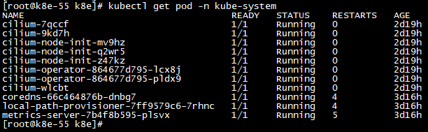
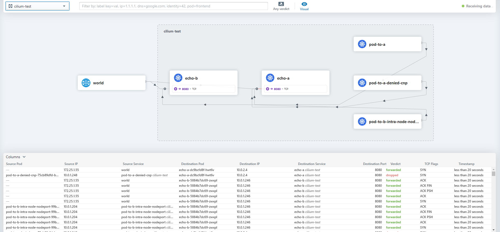

# 使用k8e快速部署Kubernetes + Cilium集群服务

节点资源列表
172.25.1.55
172.25.1.56
172.25.1.58

k8e采用cilium/eBPF网络，速度更快，可通过如下配置启动加载：

注意主机系统必须满足：**Linux kernel >= 4.9.17**
### 升级内核

下载内核升级包：http://elrepo.reloumirrors.net/kernel/el7/x86_64/RPMS/
```
rpm -ivh kernel-ml-5.11.6-1.el7.elrepo.x86_64.rpm 
rpm -ivh kernel-ml-devel-5.11.6-1.el7.elrepo.x86_64.rpm 
rpm -ivh kernel-ml-headers-5.11.6-1.el7.elrepo.x86_64.rpm
grub2-set-default 0
reboot
[root@k8e-55 k8e]# uname -r
5.11.6-1.el7.elrepo.x86_64
```

### 安装k8s集群

bootstrap server(172.25.1.55): 
```
K8E_NODE_NAME=k8e-55  K8E_TOKEN=ilovek8e /opt/k8e/k8e server --flannel-backend=none --disable-kube-proxy=true --cluster-init --disable servicelb >> k8e.log 2>&1 &
```
server 2(172.25.1.56):
```
K8E_NODE_NAME=k8e-56 K8E_TOKEN=ilovek8e /opt/k8e/k8e server --server https://172.25.1.55:6443 --flannel-backend=none --disable servicelb --disable-kube-proxy=true >> k8e.log 2>&1 &
```
server 3(172.25.1.57):
```
K8E_NODE_NAME=k8e-57 K8E_TOKEN=ilovek8e /opt/k8e/k8e server --server https://172.25.1.55:6443 --flannel-backend=none --disable servicelb --disable-kube-proxy=true >> k8e.log 2>&1 &
```

### 挂载BPF文件系统
```
sudo mount bpffs -t bpf /sys/fs/bpf
```

### 添加 helm cilium repo
```
helm repo add cilium https://helm.cilium.io/
```
### 创建 etcd ssl 证书
```
kubectl create secret generic -n kube-system cilium-etcd-secrets \
                        --from-file=etcd-client-ca.crt=/var/lib/k8e/k8e/server/tls/etcd/server-ca.crt \
                        --from-file=etcd-client.key=/var/lib/k8e/k8e/server/tls/etcd/client.key \
                        --from-file=etcd-client.crt=/var/lib/k8e/k8e/server/tls/etcd/client.crt
```
### 安装cilium 1.9.5
```
helm install cilium cilium/cilium --version 1.9.5 --set nodeinit.enabled=true \
                                                  --set nodeinit.restartPods=true \
                                                  --set tunnel=disabled \
                                                  --set bpf.masquerade=true \
                                                  --set bpf.clockProbe=true \
                                                  --set bpf.waitForMount=true \
                                                  --set bpf.preallocateMaps=true \
                                                  --set bpf.tproxy=true \
                                                  --set bpf.hostRouting=false \
                                                  --set autoDirectNodeRoutes=true \
                                                  --set localRedirectPolicy=true \
                                                  --set enableK8sEndpointSlice=true \
                                                  --set wellKnownIdentities.enabled=true \
                                                  --set sockops.enabled=true \
                                                  --set endpointRoutes.enabled=false \
                                                  --set nativeRoutingCIDR=10.43.0.0/28 \
                                                  --set enable-node-port=true \
                                                  --set hostServices.enabled=true \
                                                  --set nodePort.enabled=true \
                                                  --set hostPort.enabled=true \
                                                  --set kubeProxyReplacement=strict \
                                                  --set loadBalancer.mode=dsr \
                                                  --set k8sServiceHost=172.25.1.55 \
                                                  --set k8sServicePort=6443 \
                                                  --set global.etcd.endpoints[0]=https://172.25.1.55:2379 \
                                                  --namespace kube-system
```
### 安装成功：



### 安装Hubble可视化网络
```
helm upgrade cilium cilium/cilium --version 1.9.5 \
   --namespace kube-system \
   --reuse-values \
   --set hubble.listenAddress=":4244" \
   --set hubble.relay.enabled=true \
   --set hubble.ui.enabled=true
```
如果需要通过nodeport的方式访问，可以创建如下service，访问http://{$Externap_IP}:32000即可看到相关的策略
```yaml
apiVersion: v1
kind: Service
metadata:
  name: hubble-ui-node
  namespace: kube-system
spec:
  ports:
  - name: http
    port: 8081
    protocol: TCP
    targetPort: 8081
    nodePort: 32000
  selector:
    k8s-app: hubble-ui
  sessionAffinity: None
  type: NodePort
  ```

  
