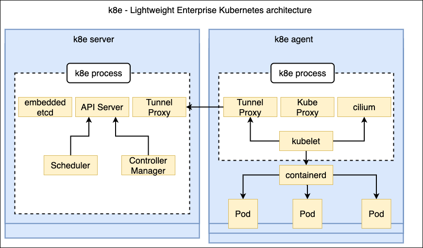

# 使用k8e快速部署Kubernetes集群服务
作为YAML工程师，经常需要使用Kubernetes集群来验证很多技术化场景，如何快速搭建一套完整标准化的集群至关重要。罗列当前能快速部署Kubernetes 集群的工具有很多种，例如官方首当其冲有**kubeadm**工具，云原生社区有**sealos**作为一键部署的最佳方案，熟悉起来后部署都非常快。但是你是否考虑过并不是每一个YAML工程师都需要非常了解集群组件的搭配。这里，我给大家推荐的工具是基于单个文件的免配置的部署方式，对比kubeadm和sealos方案，去掉了对 Kubernetes 官方组件镜像的依赖，并且把Kubernetes相关的核心扩展推荐组件也都集成到这个二进制包中，通过软链接暴露，让环境依赖更少，这个安装工具就是**k8e**(可以叫 'kuber easy' 或 K8易) 。k8e是基于当前主流上游Kubernetes发行版 k3s做的优化封装和裁剪。去掉对IoT的依赖，目标就是做最好的服务器版本的发行版本。并且和上游保持一致，可以自由扩展。

**K8e v1**架构图：




启动k8e，你可以自己放一台机器做试验就可以，**4Core/8G RAM**是最小标配。有很多朋友还想安装集群高可用模式，那么就需要三台起步。操作部署步骤如下：

1. ### 下载一键安装工具k8e
```
mkdir -p /opt/k8e && cd /opt/k8e

curl https://gitreleases.dev/gh/xiaods/k8e/latest/k8e -o k8e

curl https://raw.githubusercontent.com/xiaods/k8e/master/contrib/start-bootstrap.sh -o start-bootstrap.sh

curl https://raw.githubusercontent.com/xiaods/k8e/master/contrib/start-server.sh -o start-server.sh

curl https://raw.githubusercontent.com/xiaods/k8e/master/contrib/start-agent.sh -o start-agent.sh

curl https://raw.githubusercontent.com/xiaods/k8e/master/contrib/stop-k8e.sh -o stop-k8e.sh

curl https://raw.githubusercontent.com/xiaods/k8e/master/contrib/setup-k8s-tools.sh -o setup-k8s-tools.sh

curl https://raw.githubusercontent.com/xiaods/k8e/master/contrib/k8e-uninstall.sh -o k8e-uninstall.sh
```

2. 启动集群过程：
* 第一台，属于引导服务(注意：第一台主机IP就是**api-server**的IP)：bash start-bootstrap.sh
* 第2台到N+1台主控节点，必须是奇数，遵循**CAP原理**(注意：启动前修改api-server的IP，指向第一台主机IP)：bash start-server.sh
* 第1台到N台工作负载节点，遵循**CAP原理**(注意：启动前修改api-server的IP，指向第一台主机IP)：bash start-agent.sh
* 停掉K8：bash stop-k8e.sh
* 加载K8s工具链（kubectl ctr crictl）：bash setup-k8s-tools.sh

***Note*** : k8e 内置一个同步 api-server ip的功能，同步后三台主机，宕机任何一台，集群还是HA高可用的。

默认kubeconfig放在 /etc/k8e/k8e/k8e.yaml中。


3. 你有三台Server，就会有3个api-server的入口，一般我们期望加一个haproxy来汇聚api入口。这个可以通过kube-vip来实现。下载kubeconfig文件，就可以远程管理。注意这里对于VIP的IP，我们需要配置一个弹性IP来作为api-server的唯一入口IP，需要启动k8e时告诉它生成正确的证书。
```
--tls-san value   (listener) Add additional hostname or IP as a Subject Alternative Name in the TLS cert
```
bootstrap server和其它server都需要配置样例的参数：
```
k8e server --tls-san 192.168.1.1
```


